# ![][1] FloorspaceJS
[1]: img/favicon-32x32.png

FloorspaceJS is a 2D geometry editor. Users can define an explicit floor plan for each story of a building. A story-by-story interface makes it easy to develop space geometry and assign properties. Referencing satellite imagery or floor plan images, when available, speeds up geometry entry. Conversion of 2D to 3D geometry is currently out of scope for FloorspaceJS, a reference implementation is available in the [OpenStudio SDK](https://www.openstudio.net/).

Explicit floor plans allow more building-specific information than parameterized shoe-boxes but less information than a full 3D BIM model. Sloped walls, complex roofs, detailed shading structures, and other complex 3D structures are out of FloorspaceJS’s scope. In general, if users have a 3D BIM model in a tool that can export a useful BEM representation then it is better to use that export than to recreate a new model using FloorspaceJS. 

Re-usability and minimal dependencies were key design considerations for software developers. Web technologies can be used in both on-line and desktop applications. The editor was written in pure JavaScript for maximum portability and re-usability. A custom JavaScript Object Notation (JSON) file format was developed to ease integration with other applications. Custom JSON schema design was a key part of FloorspaceJS development.

A [paper](https://www.nrel.gov/docs/fy18osti/70491.pdf) with more information about FloorspaceJS will be published in the proceedings of [SimAUD 2018](http://simaud.org/2018/).

------

## Getting Started 

After loading FloorspaceJS, you will be prompted to create a new floorplan file, create a new floorplan file with a map background, or open an existing floorplan file. In this example we will choose to use the map background for reference.  

Navigate on the map to the place you want to locate your building using the "Search for a location" box and map navigation controls. Once you have selected where you want to place your building, use the cross hair tool to select your building's origin.  You may wish to rotate your view (press alt + shift) to align your building with the x, y axes in the editor.  Press the "Done" button to place your building and set the rotation.  Note that building placement is currently a one time operation that cannot be changed once the building is located.

[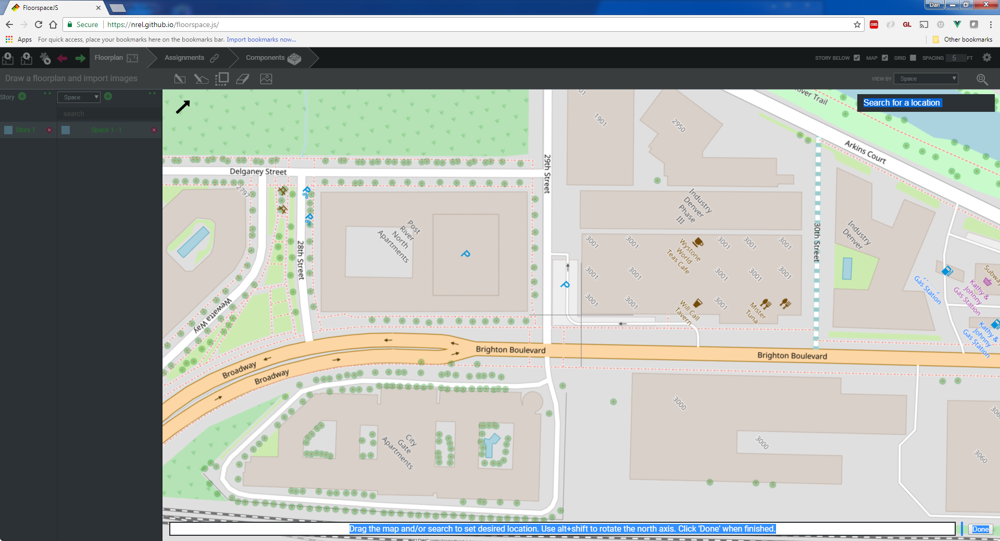](img/rotate2.png)

------

## Drawing Spaces

The Floorplan tab is used for developing geometry. The navigator on the left side of the editor is used to select the current story and space for the drawing area.  The geometry for the current story is shown, the geometry for the previous story can be toggled on and off using the "Story Below" check box in the upper right corner.  A grid can also be toggled on and off for reference when drawing.  The grid spacing may be customized as well.  Note that the units selected for drawing are set when FloorspaceJS is loaded.  Currently, the units selection may not be changed after the initial setting.  To add geometry to the currently selected space, select either the "Rectangle" or "Polygon" tool.

Once you have drawn geometry for a space, you can extend it by drawing an additional rectangle or polygon, which overlaps the existing space geometry.  This allows the creation of more complex space boundaries.  Use the "Eraser" tool to completely erase or to create cutouts within a space. Note that you cannot add new geometry for a space that does not intersect existing space geometry.  Additionally, you cannot use the eraser tool to divide a single space geometry into two or more separate pieces. 

[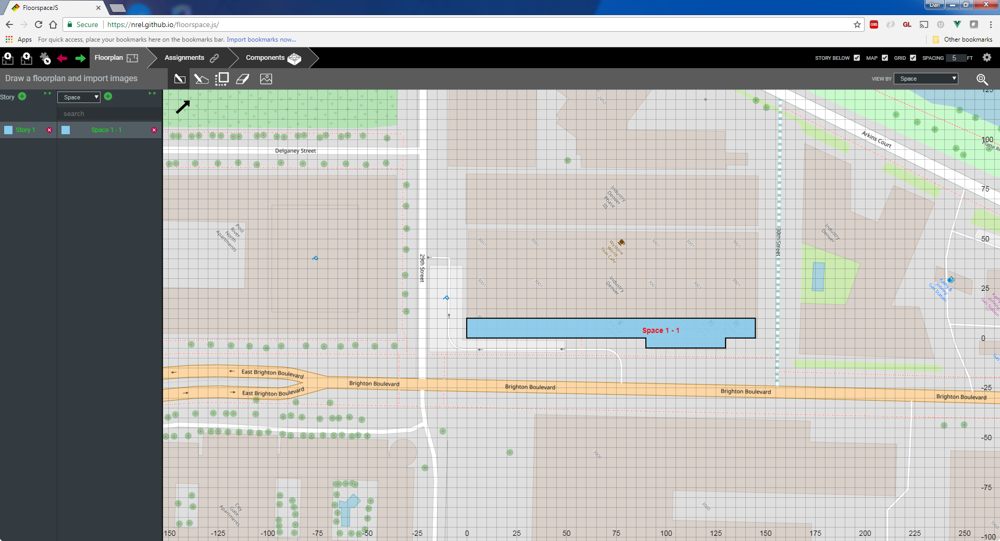](img/space1-2.png)

To create geometry for additional spaces, first create the new space by using the "+" button in the navigator.  Then, with the new space selected, draw the new space geometry.  If new space geometry overlaps existing geometry in another space, then the new geometry will be created and existing geometry in the other space will be reduced.  Geometry for multiple spaces cannot overlap.  Continue in this way to create all of the spaces for the current story.

Press the "+Story" button to create a new story.  This will automatically create a new space for the second story that you can begin to define geometry for.  

[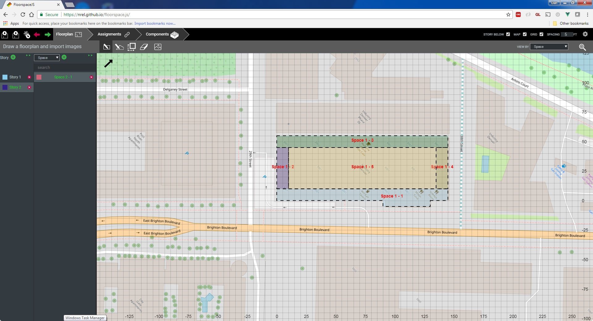](img/story2.png)

You can use the rectangle or geometry tool to create new space geometry or use the fill tool which will create geometry for the currently selected space on the current story based on geometry from the story below.

[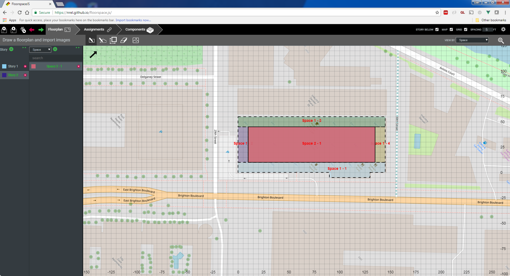](img/story2-2.png)

A floorplan image can be imported by selecting "Image" in the navigator and pressing the "+" button.  The image may be moved and scaled to correct dimension.

[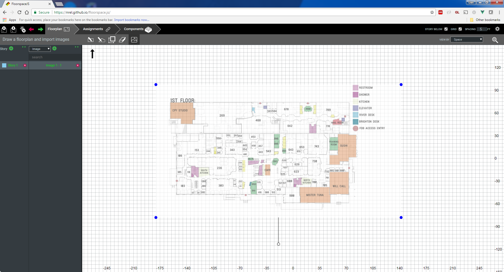](img/floorplan_image.png)

------

## Assignments

The Assignments tab provides access to specify and edit data associated with the floorplan such as space types, thermal zones, and constructions.  You can select the type of object to display in the navigator.  All objects of that type are displayed.  Press the "+" button to create new objects of that type, e.g. you can use this functionality to create a new thermal zone.  Clicking on space geometry will assign the currently selected object to that space, e.g. assigning the newly created thermal zone to an existing space.

[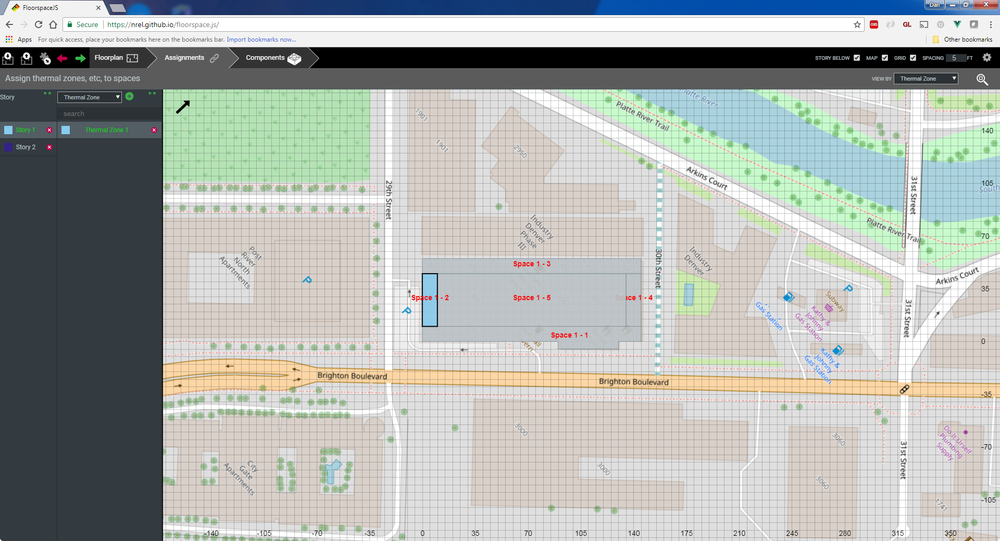](img/thermal_zone-1.png)

Continuing making new thermal zones and assigning to spaces as needed.

[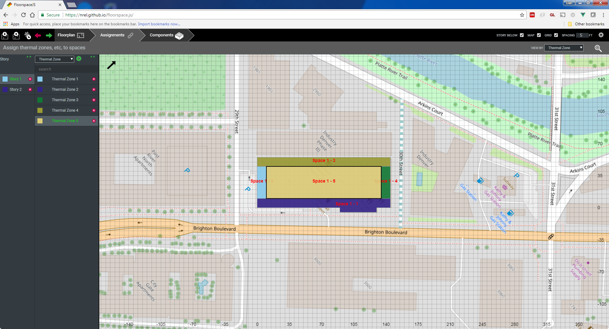](img/all_zones.png)

You can also make bulk assignments to spaces on the floorplan tab by expanding the double arrow icon next to spaces in the navigator.  From here you can make bulk assignments to spaces in a tabular format.  You can also override default values for "Floor to Ceiling Height", "Below Floor Plenum Height", "Above Ceiling Plenum Height" for individual spaces.

[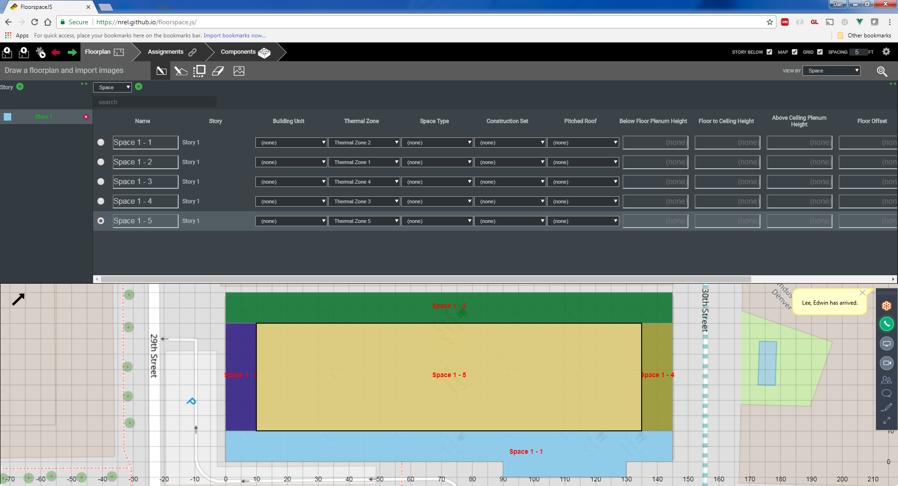](img/space_assignments.png)

Unless overridden at the space level, the default "Floor to Ceiling Height", "Below Floor Plenum Height", "Above Ceiling Plenum Height" values apply to all spaces on a given story.

[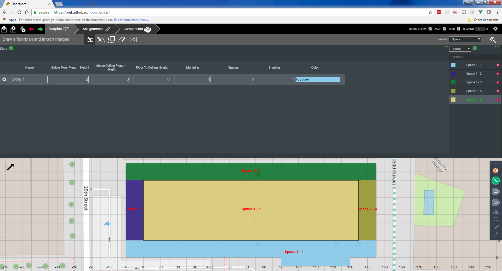](img/story_assignments.png)

------

## Components

The Components tab is used to define and place components such as windows and daylighting controls throughout the model. Select the type of components to edit in the navigator and press the "+" button to create new object definitions for that type.  For example, you can create three different types of window definitions: "Single Window" which represents a single window, "Repeating Window" which represents a pattern of repeating windows at a certain spacing, and "Window to Wall Ratio" which specifies a glazing ratio to apply.

[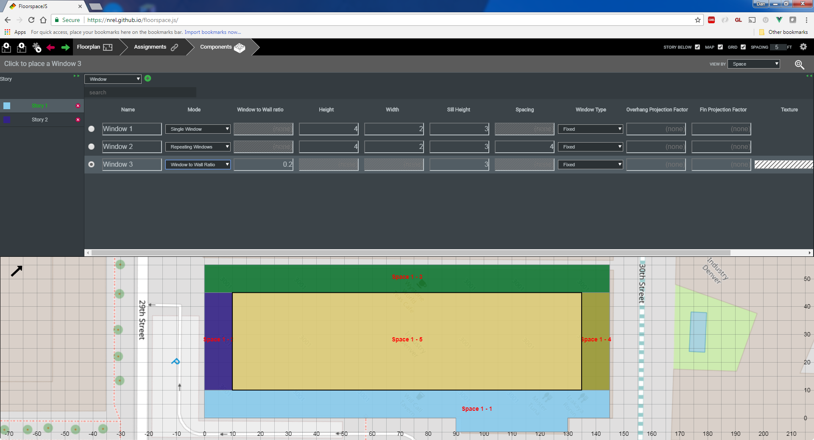](img/window_components.png)

Instances of single window definitions can be placed by selecting the window definition and then clicking on an edge.  Multiple instances of the same window definition may be placed throughout the model.

Repeating windows apply to an entire edge.

[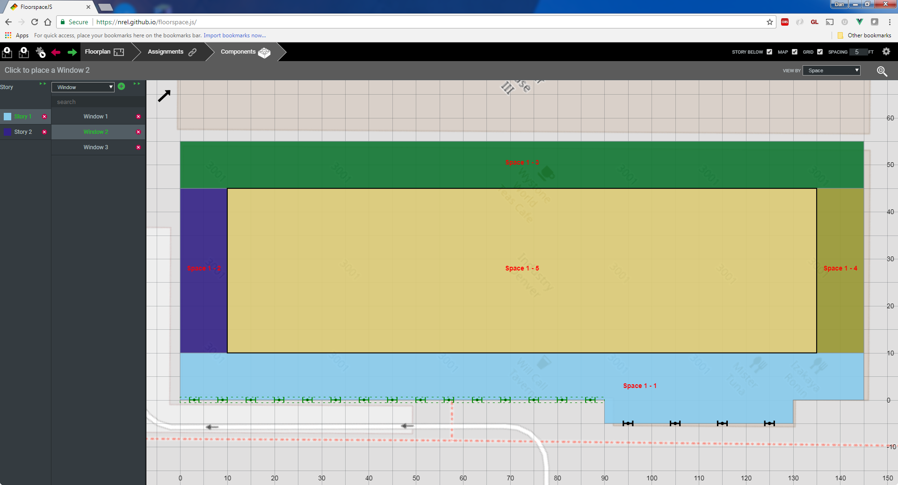](img/repeating_window.png)

Window to wall ratio definitions also apply to an entire edge.

[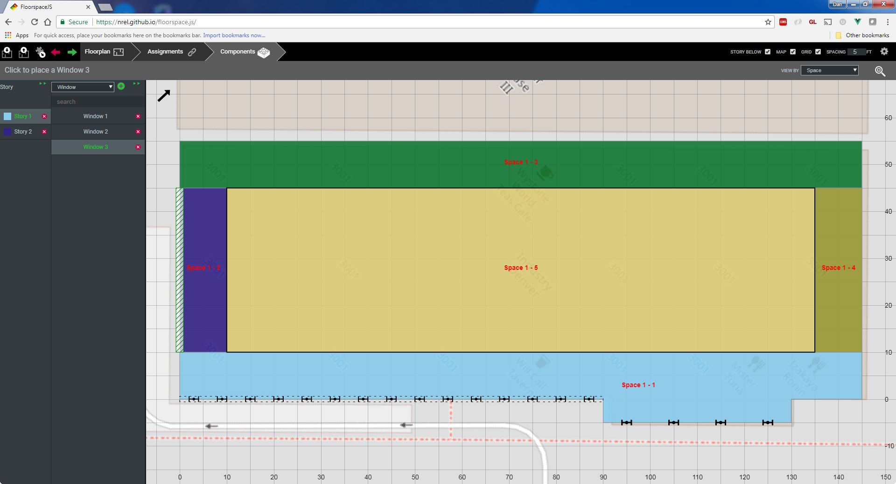](img/wwr_window.png)
